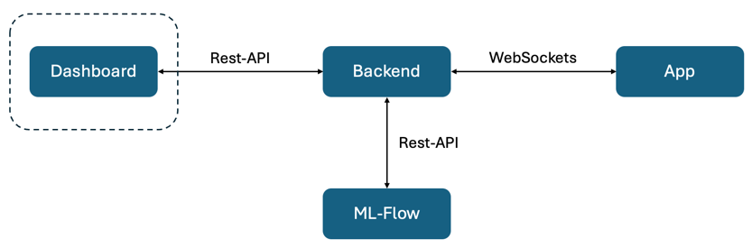
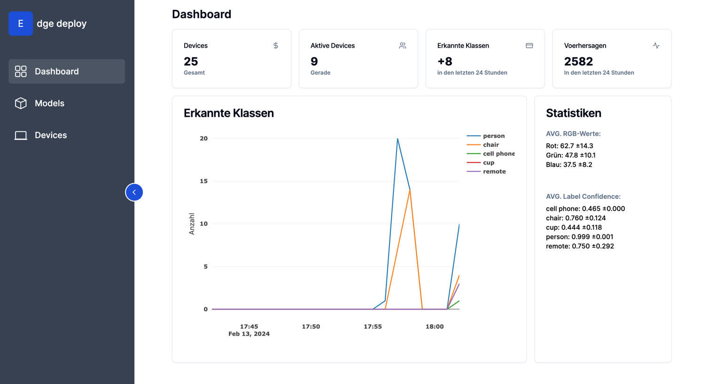
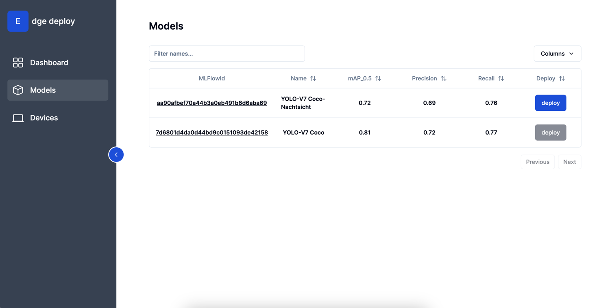
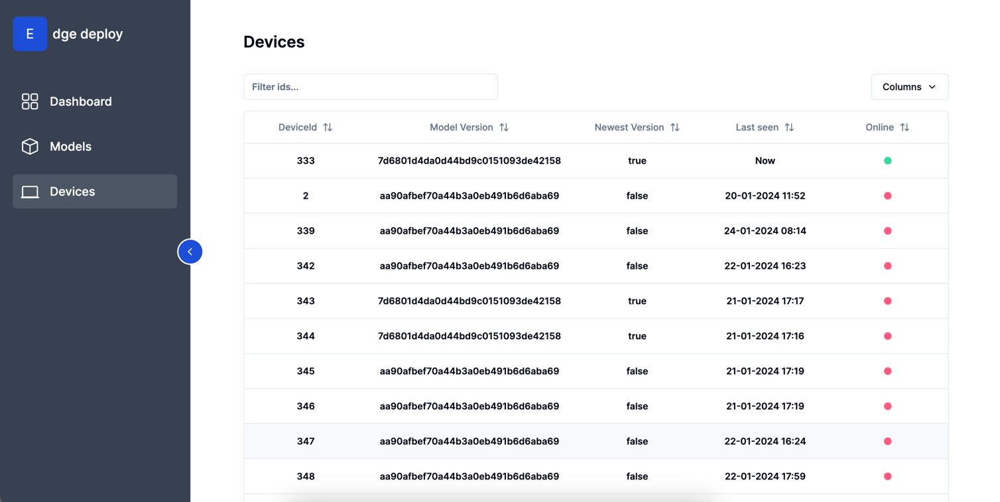

# MLFLOW-Dashboard
Anwendung zum Deployen und Überwachen von Modellen auf Edge-Devices. 

Pakete installieren: `npm install`

Starten: `npm run dev`

Im Browser [öffnen](http://localhost:3000/300530342426941322/dashboard).
_______ 
### Architektur:

[Backend-Repo](https://github.com/JonaBecher/MLOPS-backend) | [App-Repo](https://github.com/JonaBecher/MLOPS-app)
___
### Features:
### Dashboard:

- Visualisierung aller in den letzten 20 Minuten vorhergesagten Klassen. 
- Anzeige der durschnittlichen RGB-Werte der Eingabebilder.
- Auflistung der durschnittlichen Konfidenzen pro vorhergesagter Klasse.
### Models:

- Anzeige der in ML-FLOW hinterlegten Modelle mit deren Metriken. 
- One-Click Deployment der Modelle auf alle Edge-Devices. 
### Devices:

- Auflistung der bisher verbundenen Edge-Devices.
- Überblick über Version und Status aller Edge-Devices. 